# ESP32 PhotoFrame Server

A image server for the [ESP32 PhotoFrame](https://github.com/Snille/esp32-photoframe) project. This server acts as a bridge between the E-paper display and various photo sources (Google Photos, Synology Photos, Telegram), handling image processing, resizing, dithering, and overlay generation.

## Features

- **Multiple Data Sources**:
    - **Google Photos**: Uses the Picker API to securely select albums and photos.
    - **Synology Photos**: Connect directly to your Synology NAS (supports DSM 7 Personal and Shared spaces).
    - **Telegram Bot**: Send photos directly to your frame via a Telegram bot.
    - **URL Proxy**: Display images from any URL.
    - **AI Generation**: Generate unique images using OpenAI (GPT Image, DALL-E), Google Gemini, MiniMax, or a local ComfyUI server.
    - **Public Art**: Open-access museum artwork (Cleveland Museum of Art) — search the collection, preview & crop, and auto-rotate famous paintings on your frame. No API key.
- **Smart Image Processing**:
    - Automatic cropping to device aspect ratio (800x480 or 480x800).
    - **Smart Collage**: Automatically combines two landscape photos in portrait mode (or vice versa) to maximize screen usage.
    - **Dithering**: Applies Floyd-Steinberg dithering optimized for Spectra 6 color e-paper.
- **Display Order** (per device): shuffle (each photo once per cycle, then reshuffle), chronological newest- or oldest-first, or a manual custom order arranged by drag-and-drop in the Gallery.
- **Overlays**:
    - Customizable Date/Time display.
    - Real-time Weather status (Temperature + Condition) based on location.
    - **Battery badge**: shows the frame's battery level (icon, text, or both) using the level the device reports on each fetch. The icon can be rotated (0/90/180/270°), the percentage text placed on any side of it, and its size scaled independently of the overlay text.
    - **Per-element placement**: position Date, Photo Date, Weather and Battery in any of six slots (top/bottom × left/center/right), with an adjustable size scale and a live preview in the device settings.
    - "iPhone Lockscreen" style aesthetics with Inter font and drop shadows.
- **Home Assistant MQTT**: Publishes each frame to your Home Assistant MQTT broker via MQTT discovery — **battery, battery voltage, days-remaining, trend, last-seen, sleep schedule, next image pull, host, IP-address, timezone, display rotation, server host, last trigger, collage, next-image-status, rotation size/status/position/remaining, rotation completes, current photo date, Immich albums, online/offline and current-photo-favorite** sensors, writable **Image Source / Image Order / Refresh Interval / Deep Sleep / Auto Rotate / On This Day / Favorites Only** controls, **Rotate Now**, **Reshuffle**, **Hide Current Photo** and **Toggle Favorite** buttons, plus **Previous / Current / Next image** entities per frame, ready for automations. (Next Image shows as *Unavailable* on frames running collage mode, which has no deterministic next image.) Runs as a plain MQTT client (its own broker credentials); no add-on required. Configure it under Settings → **Home Assistant**.
- **Per-device activity log**: every image-pull attempt a frame makes — success or failure — with timestamp, result, trigger (timer/button/boot), source and battery level. Open it from the log icon next to each frame in the Devices list; retention (days/months/years, default 6 months) is configurable per device, and the log can be downloaded as CSV.
- **Authentication**:
    - User account system with login/registration.
    - Revocable API tokens for device access.
    - Session management.

## Screenshots

### Web interface

The main view: the photo gallery plus the devices list, where every frame shows a
live miniature of its current image alongside battery percentage and estimated
days remaining.

<p>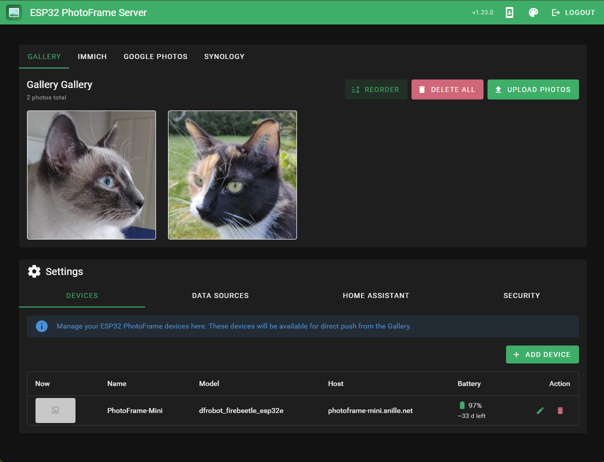</p>

<table>
<tr>
<td>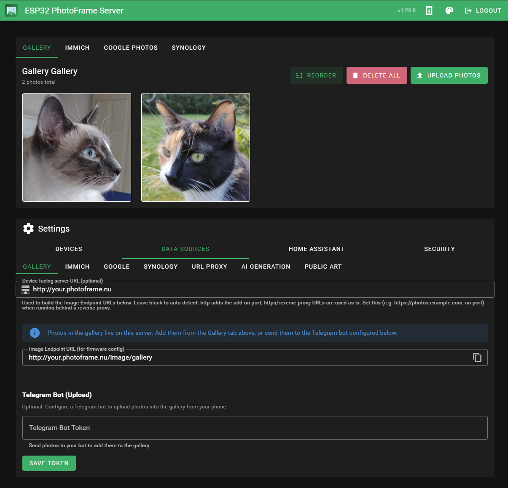<br/><sub><b>Gallery</b> — uploaded and synced photos in one place</sub></td>
<td>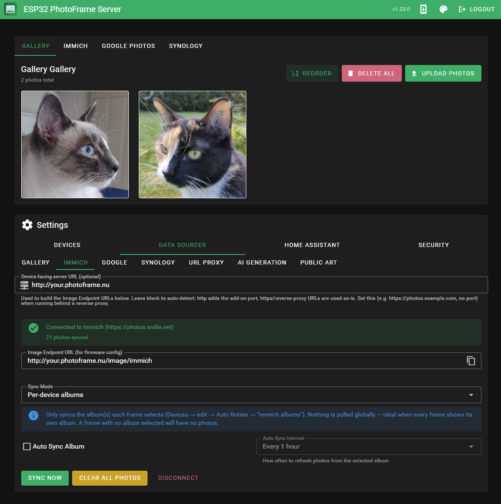<br/><sub><b>Data sources · Immich</b> — albums, sync modes, per-frame filtering</sub></td>
</tr>
<tr>
<td>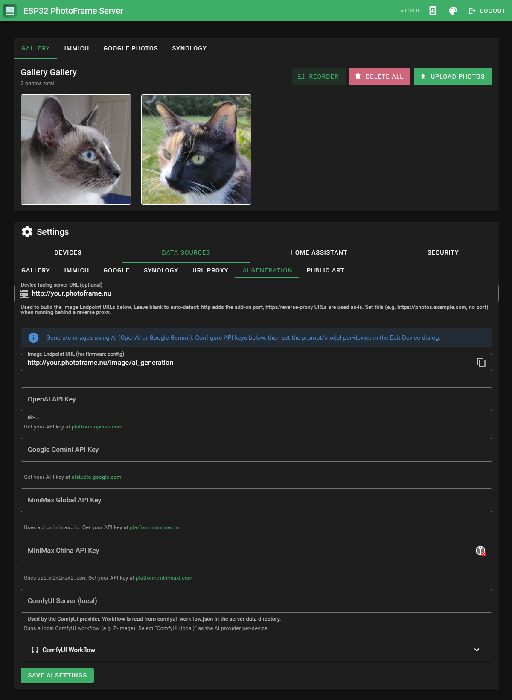<br/><sub><b>Data sources · AI</b> — generation providers (ComfyUI, OpenAI, Gemini, MiniMax)</sub></td>
<td>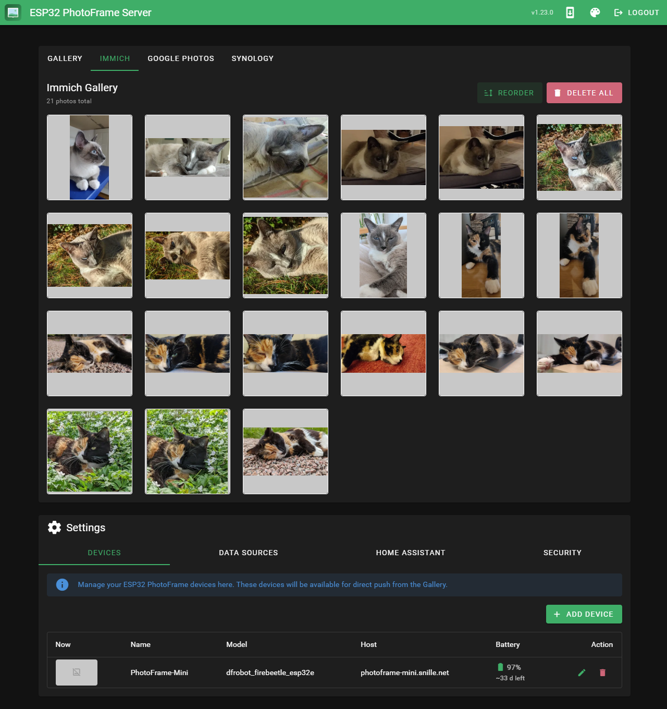<br/><sub><b>Per-device albums</b> — pick which Immich albums each frame pulls from</sub></td>
</tr>
<tr>
<td>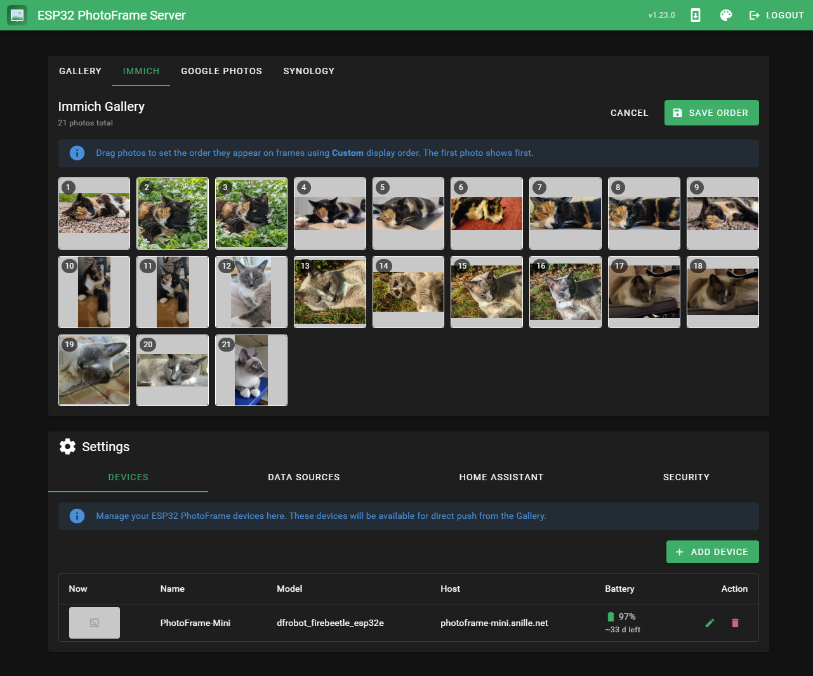<br/><sub><b>Display order</b> — drag-and-drop to set a frame's photo order</sub></td>
<td></td>
</tr>
</table>

### Per-frame configuration

Every frame is configured server-side from a tabbed dialog — all rich processing
runs on the server, so it works even while the frame is deep-asleep.

<table>
<tr>
<td>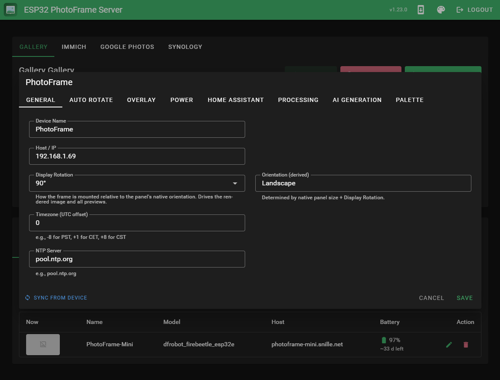<br/><sub><b>General</b> — name, host, display rotation, timezone</sub></td>
<td>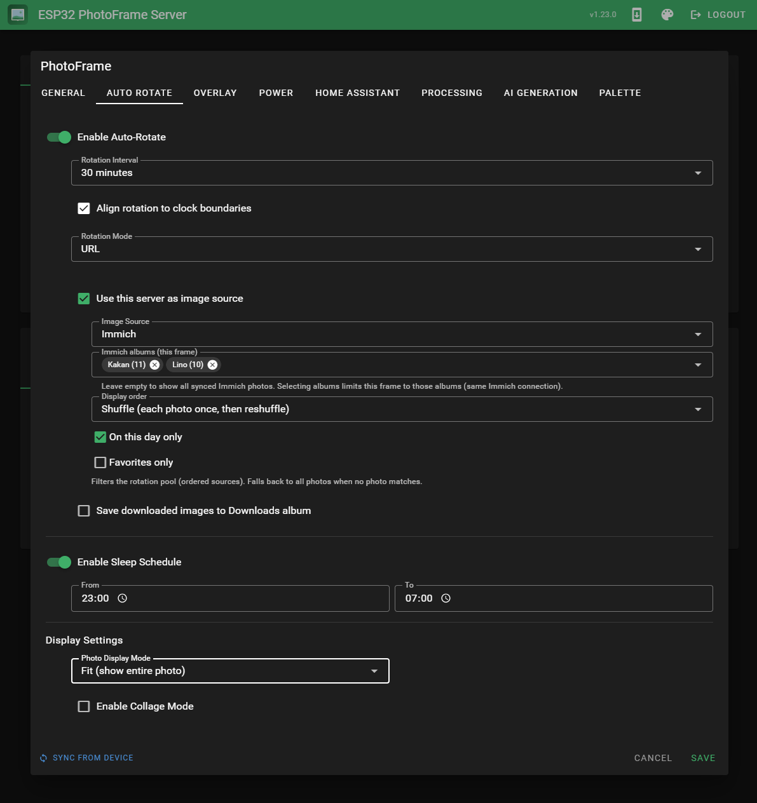<br/><sub><b>Auto Rotate</b> — image source, interval, sleep schedule, filters</sub></td>
<td>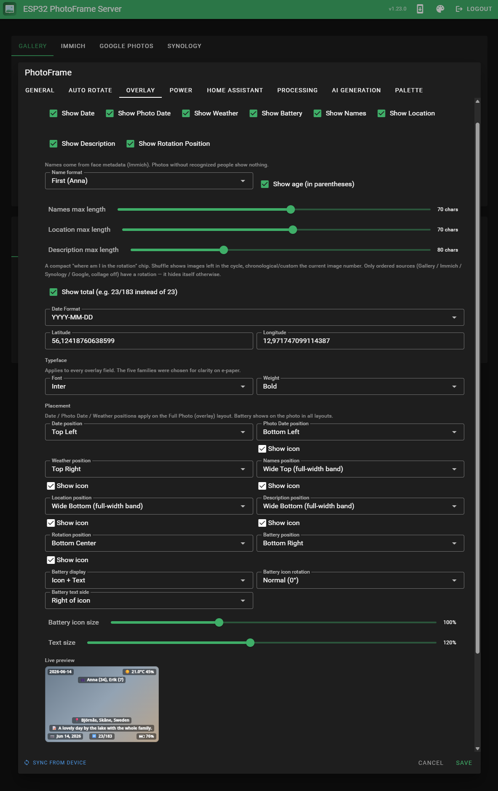<br/><sub><b>Overlay</b> — date / weather / people / location / battery badges + placement</sub></td>
</tr>
<tr>
<td>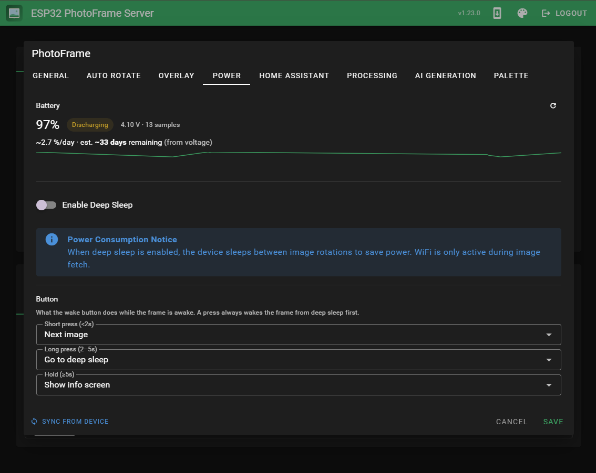<br/><sub><b>Power</b> — battery trend, days-remaining estimate, deep sleep</sub></td>
<td>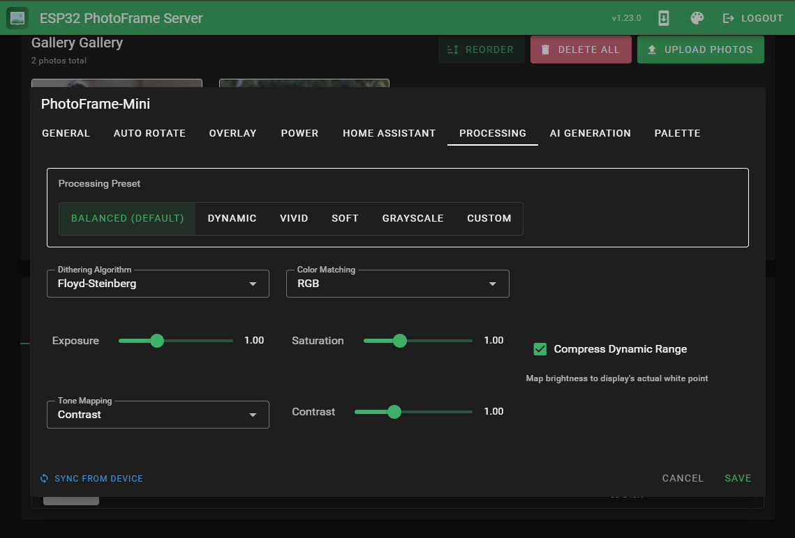<br/><sub><b>Processing</b> — dithering, measured palette, tone presets</sub></td>
<td>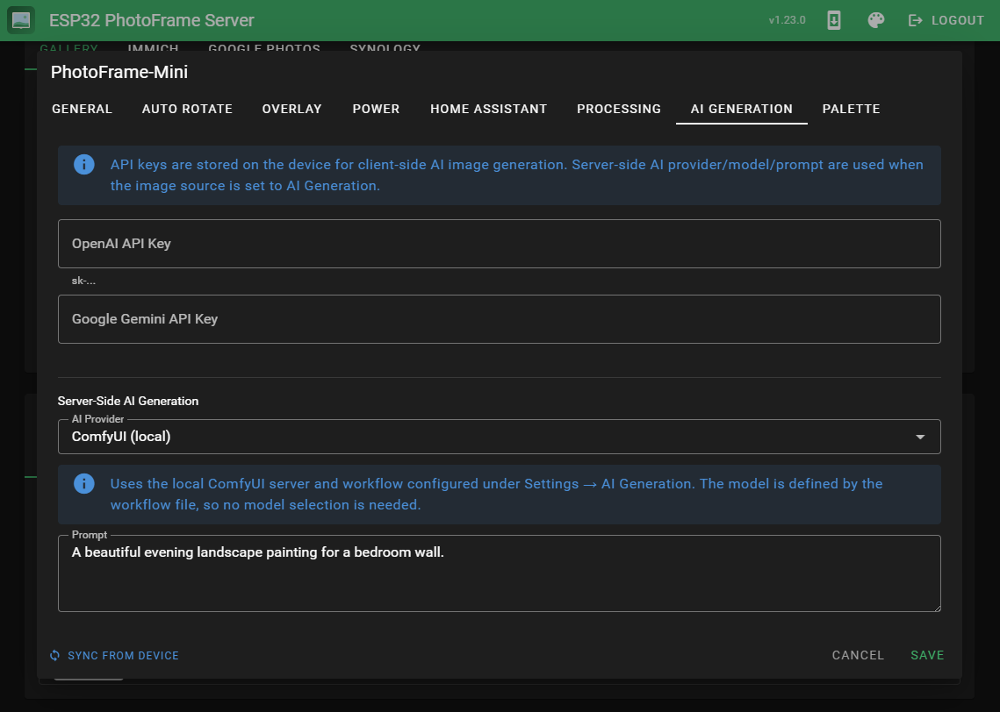<br/><sub><b>AI Generation</b> — per-frame provider and prompt</sub></td>
</tr>
</table>

## Deployment

### Home Assistant Add-on (Recommended)

The easiest way to run the server is as a Home Assistant add-on.

#### Installation

1. **Add Repository**:
   - Go to **Settings** → **Add-ons** → **Add-on Store** → **⋮** (three dots) → **Repositories**
   - Add: `https://github.com/aitjcize/esp32-photoframe-server`

2. **Install Add-on**:
   - Find "ESP32 PhotoFrame Server" in the add-on store
   - Click **Install**
   - Wait for the build to complete (5-15 minutes on first install)

3. **Configure**:
   - The add-on uses `/data` for persistent storage (automatically backed up)
   - Port 9607 is exposed for direct device access
   - **Ingress** is enabled - access via Home Assistant sidebar

4. **Start**:
   - Click **Start**
   - Enable **Start on boot** if desired
   - Access via the sidebar or `http://homeassistant.local:9607`

#### Data Migration

If upgrading from a previous version that used `/config/esp32-photoframe-server/`:
- Data is automatically migrated to `/data` on first startup
- Check logs to verify migration completed successfully
- Old data in `/config` can be manually removed after verification

### Docker (Standalone)

For non-Home Assistant deployments:

```bash
docker run -d \
  -p 9607:9607 \
  -v /path/to/data:/data \
  --name photoframe-server \
  aitjcize/esp32-photoframe-server:latest
```

## Configuration

Access the dashboard at `http://localhost:9607` (or your server IP, or via Home Assistant ingress).

### Initial Setup

1. **Create Account**:
   - On first launch, you'll be prompted to create an admin account
   - Enter a username and password

2. **Generate Device Token**:
   - Go to **Settings** → **Account**
   - Click **Generate New Token**
   - Give it a name (e.g., "Living Room Frame")
   - Copy the token - you'll need this for your ESP32 device

### Google Photos Setup

> [!IMPORTANT]
> **Google OAuth Restriction**: Google does not allow `.local` domains or private IP addresses in OAuth redirect URIs. If running on Home Assistant, you must use one of these methods:
> - **Port Forwarding** (recommended for one-time setup): `ssh -L 9607:localhost:9607 root@homeassistant.local -p 22222`
> - **Public Domain**: Use a domain name with Cloudflare Tunnel or similar

#### Steps:

1. **Create OAuth Credentials**:
   - Go to [Google Cloud Console](https://console.cloud.google.com/)
   - Create a new project or select an existing one
   - Enable the **Google Photos Picker API**
   - Go to **Credentials** → **Create Credentials** → **OAuth 2.0 Client ID**
   - Application type: **Web application**
   - **Authorized JavaScript Origins**: `http://localhost:9607`
   - **Authorized Redirect URIs**: `http://localhost:9607/api/auth/google/callback`
   - Click **Create** and save your Client ID and Client Secret

2. **Configure the Server**:
   - If running on Home Assistant, set up port forwarding first:
     ```bash
     ssh -L 9607:localhost:9607 root@homeassistant.local -p 22222
     ```
   - Access the dashboard at `http://localhost:9607`
   - Go to **Settings** → **Data Sources**
   - Select **Source: Google Photos**
   - Enter your **Client ID** and **Client Secret**
   - Click **Save All Settings**

3. **Authenticate and Import Photos**:
   - Go to the **Gallery** tab
   - Click **Add Photos via Google**
   - You'll be redirected to Google OAuth (sign in if needed)
   - Select the photos you want to display
   - Click **Add** to import them

4. **After Setup**:
   - The OAuth token is saved in the database
   - You can close the SSH tunnel (if used)
   - Access the server normally via Home Assistant ingress or `http://homeassistant.local:9607`
   - Re-authentication is only needed if you revoke access or want to add more photos

### Synology Setup

1. Go to **Settings** → **Data Sources** in the dashboard.
2. Enable **Synology Photos**.
3. Enter your **NAS URL** (e.g., `https://192.168.1.10:5001`), **Account**, and **Password**.
4. If using 2FA, enter the **OTP Code** when testing the connection.
5. Select the **Photo Space** (Personal or Shared) and optionally a specific **Album**.
6. Click **Sync Now** to import metadata.

### Telegram Setup

1. Create a new bot via [@BotFather](https://t.me/botfather) on Telegram.
2. Get the **Bot Token**.
3. Go to **Settings** → **Data Sources** in the dashboard.
4. Select **Source: Telegram Bot**.
5. Enter your Bot Token and save.
6. Send a photo to your bot on Telegram. The frame will update to show this photo immediately.

### URL Proxy Setup

1. Go to **Settings** → **Data Sources**.
2. Select **Source: URL Proxy**.
3. Add URLs to images you want to display.
4. Assign URLs to specific devices.

### AI Generation Setup

Generate unique AI artwork for your photo frame using OpenAI or Google Gemini.

1. **Get an API Key**:
   - **OpenAI**: Get your key at [platform.openai.com/api-keys](https://platform.openai.com/api-keys)
   - **Google Gemini**: Get your key at [aistudio.google.com/app/apikey](https://aistudio.google.com/app/apikey)

2. **Configure API Keys**:
   - Go to **Settings** → **Data Sources** → **AI Generation**
   - Enter your API key(s) and click **Save API Keys**

3. **Configure Per-Device**:
   - Go to **Settings** → **Devices**
   - Click **Edit** on the device you want to configure
   - Under **AI Image Generation**, select a provider (OpenAI or Google Gemini)
   - Choose a model and enter a prompt describing the images you want
   - Click **Save**

4. **Available Models**:
   - **OpenAI**: GPT Image 1, DALL-E 3, DALL-E 2
   - **Google Gemini**: Gemini 2.5 Flash Image, Gemini 3 Pro Image

## Photo Frame Configuration

Once you've configured a photo source, the correct URL will be displayed in the settings:

```
http(s)://<hostname/IP address>:9607/image/<source>
```

1. Copy the URL from the settings page.
2. Copy your device token from **Settings** → **Account**.
3. Log into the photo frame web app.
4. Go to the Auto-Rotate tab and paste the URL and Token in the appropriate boxes.
5. Click the 'Save Settings' button.

## API Endpoints (For ESP32)

### Image Endpoints

- **`GET /image/google_photos`**: Returns a random image from **Google Photos**.
- **`GET /image/synology_photos`**: Returns a random image from **Synology Photos**.
- **`GET /image/telegram`**: Returns the last photo sent via **Telegram Bot**.
- **`GET /image/url_proxy`**: Returns a random image from configured URLs.
- **`GET /image/ai_generation`**: Returns a newly generated AI image based on device prompt.
- **`GET /image/public_art`**: Returns open-access museum artwork (Cleveland Museum of Art) — a locked selection, or the best-ranked result for the configured query.

### Authentication

All image endpoints require authentication via Bearer token:

```
Authorization: Bearer <your-device-token>
```

#### Building

```bash
# Build Docker image
docker build -t esp32-photoframe-server .

# Or use make
make build
make run
```

### Home Assistant Add-on Development

Use the included `deploy-dev.sh` script for rapid local testing:

```bash
./deploy-dev.sh [ssh-host]
```

This script:
- Syncs code to Home Assistant's local add-on directory
- Modifies config for development (port 9608, dev slug)
- Triggers Supervisor to rebuild and restart the add-on

## Support

If you find this project useful, consider buying me a coffee! ☕

[](https://buymeacoffee.com/aitjcize)

## License

MIT License - see LICENSE file for details.
