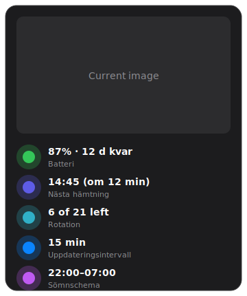

# Home Assistant – PhotoFrame card

A polished Lovelace card that shows the frame's **current image** with a side panel
of live values: battery / days remaining, next pull, rotation status, refresh
interval and sleep schedule. All values come from the entities the MQTT bridge
already exposes — no extra configuration on the server.



## Requirements

Install via [HACS](https://hacs.xyz/) (Frontend):

- **Mushroom** (`custom:mushroom-*`)
- **stack-in-card** (`custom:stack-in-card`) — merges the image + rows into one seamless card

## Find your entity IDs

Every entity is named `…photoframe_<frame name>_<key>`. Open
**Settings → Devices & services → MQTT**, click your frame, and copy the real IDs.
For a frame named *PhotoFrame-Mini* they look like:

| Value | Entity |
| --- | --- |
| Current image | `image.photoframe_photoframe_mini_image` |
| Battery | `sensor.photoframe_photoframe_mini_battery` |
| Days remaining | `sensor.photoframe_photoframe_mini_days_remaining` |
| Battery trend | `sensor.photoframe_photoframe_mini_trend` |
| Next pull | `sensor.photoframe_photoframe_mini_next_pull` |
| Rotation status | `sensor.photoframe_photoframe_mini_rotation_status` |
| Refresh interval | `number.photoframe_photoframe_mini_refresh_interval` |
| Sleep schedule | `sensor.photoframe_photoframe_mini_sleep_schedule` |
| Skip queue (±N) | `number.photoframe_photoframe_mini_skip` |

Replace `photoframe_photoframe_mini` everywhere below with your own prefix
(easiest: paste the YAML, then use the editor's find/replace).

## The card

Image on top, a tidy column of Mushroom rows underneath — one seamless card.

```yaml
type: custom:stack-in-card
mode: vertical
cards:
  # --- Current image on the frame ---
  - type: picture-entity
    entity: image.photoframe_photoframe_mini_image
    show_name: false
    show_state: false
    camera_view: auto
    tap_action:
      action: more-info

  # --- Battery / days remaining ---
  - type: custom:mushroom-template-card
    primary: >-
      
      
      
      
      {{ b }}% · {{ extra }}
    secondary: Batteri
    icon: >-
      
       mdi:battery
       mdi:battery-{{ (b / 10) | int * 10 }}
       mdi:battery-outline 
    icon_color: >-
      
       green  orange  red 
    tap_action:
      action: more-info
      entity: sensor.photoframe_photoframe_mini_battery

  # --- Next pull (frame-reported, exact) ---
  - type: custom:mushroom-template-card
    primary: >-
      
       –
       {{ as_timestamp(t) | timestamp_custom('%H:%M', true) }}
      ({{ relative_time(as_datetime(t)) if as_timestamp(t) < as_timestamp(now())
         else 'om ' ~ timedelta(seconds=(as_timestamp(t) - as_timestamp(now())) | int) }})
      
    secondary: Nästa hämtning
    icon: mdi:timer-play-outline
    icon_color: indigo

  # --- Rotation status ---
  - type: custom:mushroom-template-card
    primary: "{{ states('sensor.photoframe_photoframe_mini_rotation_status') }}"
    secondary: Rotation
    icon: mdi:playlist-play
    icon_color: teal
    tap_action:
      action: more-info
      entity: sensor.photoframe_photoframe_mini_rotation_status

  # --- Refresh interval (also editable: tap to change) ---
  - type: custom:mushroom-template-card
    primary: "{{ states('number.photoframe_photoframe_mini_refresh_interval') }} min"
    secondary: Uppdateringsintervall
    icon: mdi:timer-sync-outline
    icon_color: blue
    tap_action:
      action: more-info
      entity: number.photoframe_photoframe_mini_refresh_interval

  # --- Sleep schedule ---
  - type: custom:mushroom-template-card
    primary: "{{ states('sensor.photoframe_photoframe_mini_sleep_schedule') }}"
    secondary: Sömnschema
    icon: mdi:weather-night
    icon_color: deep-purple

  # --- Skip queue: type +N to jump forward, -N to jump back; snaps back to 0 ---
  - type: custom:mushroom-number-card
    entity: number.photoframe_photoframe_mini_skip
    name: Hoppa i kön (±)
    icon: mdi:debug-step-over
    display_mode: buttons
```

> **Skip Queue** is a **one-time** jump, not a permanent setting: enter `+3` to
> skip three images forward, `-1` to go back one, applied on the frame's *next*
> pull. The number snaps back to `0` right after — it does **not** skip on every
> pull. It works for ordered sources (shuffle / newest / oldest / custom); it's a
> no-op in collage mode. On the deep-sleeping FireBeetle the jump takes effect at
> the next scheduled wake, not instantly.

## Side-by-side variant

Prefer the image **beside** the values (the original "side view")? Wrap the image
and a nested vertical stack of the same Mushroom rows in a `horizontal-stack`:

```yaml
type: custom:stack-in-card
mode: horizontal
cards:
  - type: picture-entity
    entity: image.photoframe_photoframe_mini_image
    show_name: false
    show_state: false
    camera_view: auto
  - type: custom:stack-in-card
    mode: vertical
    cards:
      # … paste the five mushroom-template-card blocks from above here …
```

On narrow/mobile dashboards the vertical (top) layout reads better; the
side-by-side variant suits a wide desktop dashboard.
